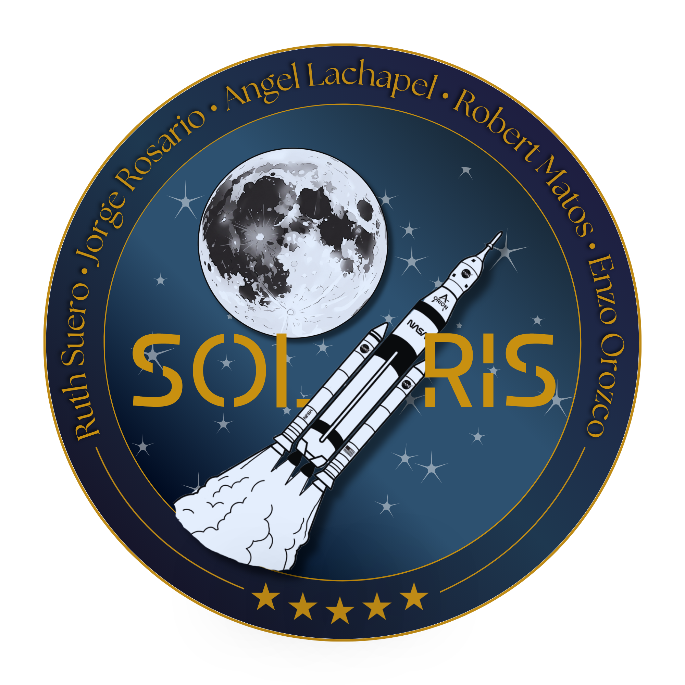

<p align="center">
  
</p>

# Simulador de Misión Lunar — Artemis II

## Nombre de nuestra misión: SOLARIS

## Descripción del Proyecto

Proyecto académico de la asignatura INF-272-01, orientado al desarrollo de un simulador inspirado en la misión Artemis II, utilizando herramientas de programación, control de versiones y trabajo colaborativo.

---

# Tripulación 2

| Integrante | Rol | Siglas |
|---|---|---|
| Ruth Suero | Comandante / Gestor de Proyectos | CDR |
| Jorge Rosario | Ingeniero de Requisitos | REQ |
| Angel Lachapel | Arquitecto de Software | ARCH |
| Robert Matos | Oficial de Dinámica de Vuelo | FDO |
| Enzo Orozco | Comunicador de Cápsula / Líder de Interfaz | CAPCOM |

---

# Política de Ramificación y Reglas de Trabajo

Con el objetivo de mantener un desarrollo organizado, estable y sin conflictos dentro del proyecto, el equipo acuerda las siguientes normas de trabajo en Git y GitHub.

## Rama Principal

- La rama `main` representa la versión estable del proyecto.
- Está prohibido realizar cambios directamente sobre `main`.
- Todo cambio deberá integrarse mediante Pull Request.

---

## Convención de Ramas

Cada nueva tarea deberá desarrollarse en una rama independiente creada desde `main`.

| Tipo | Uso | Ejemplo |
|---|---|---|
| `feature/` | Nuevas funcionalidades | `feature/diseno-parche` |
| `fix/` | Corrección de errores | `fix/error-orbita` |
| `docs/` | Documentación | `docs/readme-inicial` |

---

## Flujo de Trabajo

1. Actualizar la rama `main`
2. Crear una nueva rama para la tarea
3. Realizar cambios y commits descriptivos
4. Subir la rama a GitHub
5. Abrir un Pull Request hacia `main`
6. Esperar revisión y aprobación de otro integrante
7. Fusionar únicamente después de la aprobación

---

## Revisión de Código

- Ningún integrante puede aprobar su propio Pull Request.
- Al menos un miembro del equipo debe revisar el código.
- La revisión debe verificar:
  - funcionamiento,
  - claridad,
  - compilación correcta,
  - ausencia de errores importantes.
- Tiempo máximo recomendado para revisión: 24 horas.

---

## Formato de Commits

Cada commit debe iniciar con una etiqueta que identifique el área modificada.

| Etiqueta | Uso |
|---|---|
| `[CORE]` | Física, lógica y simulación |
| `[UI]` | Interfaz gráfica |
| `[DOCS]` | Documentación |
| `[TEST]` | Pruebas |
| `[CONFIG]` | Configuración del proyecto |

### Ejemplos

```bash
[DOCS] Agregar política de ramificación
[CORE] Implementar cálculo de trayectoria
[UI] Mejorar panel de control
```

---

## Versiones del Proyecto

| Versión | Descripción |
|---|---|
| `v0.1-fase3` | Implementación inicial |
| `v0.5-beta` | Versión de pruebas |
| `v1.0-final` | Entrega final del proyecto |

---

## Tecnologías Utilizadas

- Java
- Maven
- Orekit
- Git
- GitHub
- Visual Studio Code

---

## Estado del Proyecto

En desarrollo... ^_^
